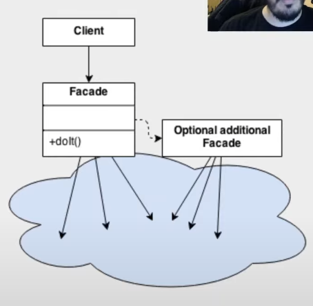

# Facade

é um padrão de projeto Estrutural que provê uma interface que reduza a complexidade nas integrações com subsistemas
***aparentemente é muito parecido com um proxy***

É bem comum ser usado para criar-se uma interface de uso mais simples e mais tranquila de ser consumida e que o facade abstraia toda a complexidade de inteegração dos sistemas dentro dele

É um pouco controverso(Alguns o chamam de anti pattern pode quebrar alguns principios do SOLID dependedo da maneira que é implementado) - O conceito é muito válido e importante, são muito parecidos com ideias de APIs que são basicamente interfaces que facilitam o acesso a informações de sistemas através de chamadas que são muito mais simples do que ter que desenvolver todas as regras de negócio que geram a informação desejada que é provida pela API

 
